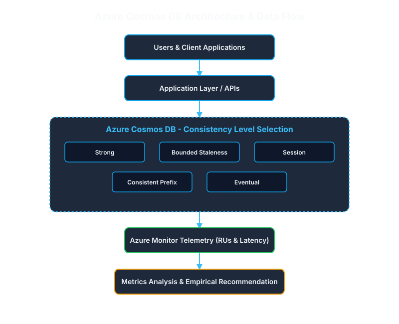

# Azure Cosmos DB Consistency Level Selection Study

**Project Code:** 24CC3046-P048  
**Department:** Computer Science and Engineering  
**Institution:** KL University / KLEF Vaddeswaram  

---

## 📄 Abstract

Modern distributed cloud applications require a strategic balance between data consistency, low-latency performance, high availability, and global scalability. Microsoft Azure Cosmos DB addresses these dynamic requirements by offering five well-defined consistency levels—**Strong, Bounded Staleness, Session, Consistent Prefix, and Eventual**—providing a continuous spectrum between strict data correctness and high operational performance. Selecting an improper consistency level can result in stale data visibility, increased read/write latency overhead, degraded user experience, or unnecessary infrastructure costs.

This project presents a systematic, empirical methodology to evaluate and select the optimal Azure Cosmos DB consistency level based on specific application requirements. By simulating real-world workloads across diverse domain scenarios—including **Banking (Financial Integrity), E-Commerce (Session Consistency), Social Media (High Speed/Availability), and Healthcare (Data Accuracy)**—this study analyzes operational trade-offs across global multi-region deployments. Performance metrics, including Request Unit (RU/s) consumption, server-side latency, read/write execution times, and replication lag, are captured and evaluated using **Azure Monitor**. The findings establish that consistency model selection must be driven by empirical, workload-specific observation rather than broad industry categorization alone, offering developers a structured framework to justify cloud database configuration choices.

---

## 🏗️ Architecture Diagram



---

## 👥 Team Members

* **Lella Rohitha** - 2400030280
* **Namburi Reethika** - 2400030265
* **Vuyyuru Tejesh** - 2400030254
* **Bhavanam Joshika** - 2400030221

---

## 🛠️ Required Azure Services & Resources

| Service / Resource | Purpose | Configuration / Function |
| :--- | :--- | :--- |
| **Azure Resource Group** | Resource Management Boundary | Container used to organize, deploy, and manage all project resources as a single unit. |
| **Azure Cosmos DB** | Multi-Model NoSQL Database | Hosts container data across multi-region active replication settings to test all 5 consistency levels. |
| **Azure Monitor** | Observability & Telemetry Engine | Tracks Request Unit (RU) consumption, read/write latency, server execution times, and replication lag. |
| **Metrics Analysis Tool** | Performance Analytics | Processes log analytics to evaluate trade-offs between consistency guarantees and performance. |

---

## ⚙️ Live Azure Deployment Configuration

- **Resource Group:** `rg-cosmos-consistency-study`
- **Cosmos DB Account:** `cosmos-consistency-demo-2026` (East US 2)
- **Database:** `ECommerceDB`
- **Container:** `Orders`
- **Partition Key:** `/category`
- **Provisioned Throughput:** 400 RU/s
- **Selected Consistency Level:** Session Consistency

---

## 🔄 Project Workflow Diagram

```text
===================================================================
             AZURE COSMOS DB PROJECT WORKFLOW
===================================================================

[User / Client Application Session]
            │
            ▼
[Resource Group: rg-cosmos-consistency-study]
            │
            ▼
[Cosmos DB Account: cosmos-consistency-demo-2026]
 (Region: East US 2 | Default Consistency: Session)
            │
            ▼
[Database: ECommerceDB]
            │
            ▼
[Container: Orders]
 (Throughput: 400 RU/s | Partition Key: /category)
            │
            ├───────────────► Document 1: ord_101 (Electronics)
            │
            └───────────────► Document 2: ord_102 (Electronics)
📊 Performance & Operational Findings
Session Consistency Efficiency: Session consistency provides the optimal configuration for e-commerce user workflows by guaranteeing Read-Your-Own-Writes and Monotonic Reads within active sessions while keeping latency and RU costs equivalent to Eventual consistency.

Logical Partitioning Optimization: Partitioning by /category ensures that common query access patterns execute as single-partition queries, eliminating the performance and RU overhead associated with cross-partition fan-outs.

Throughput Stability: The database baseline operates stably within the 400 RU/s provisioned limit, successfully processing schema-agnostic CRUD operations and SQL query fetches.
